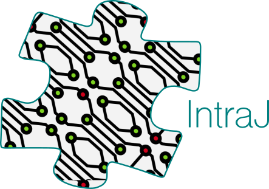
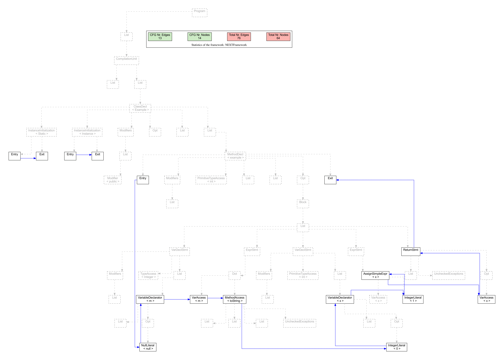

<p align="center">
  
</p>

This repository is a snapshot of the *IntraJ* ([6bcd885](https://github.com/lu-cs-sde/IntraJ/commit/6bcd8859ad0610ee938940f0814a838dac126f52)) and *IntraCFG* ([479e927](https://github.com/lu-cs-sde/IntraCFG/commit/479e9272809324296b623c6ff6872f216a10093d)) projects and will not change in the future.
The purpose of this repository is to have a static reference of what we described in the paper submitted at IEEE-SCAM2021:

* __[A Precise Framework for Source-Level Control-Flow Analysis](http://creichen.net/papers/intraj.pdf)__, _[Idriss Riouak 🔗](https://github.com/IdrissRio), [Christoph Reichenbach 🔗](https://creichen.net), [Görel Hedin 🔗](https://cs.lth.se/gorel-hedin/) and [Niklas Fors 🔗](https://portal.research.lu.se/portal/en/persons/niklas-fors(c1e9efdd-5891-45ec-aa9d-87b8fb7f3dbc).html)_. _[IEEE-SCAM 2021 🔗](http://www.ieee-scam.org/2021/#home)._ 

**IntraJ** is an application of the **[IntraCFG](https://github.com/lu-cs-sde/IntraCFG)** framework for the Java language, build as an extension of the **[ExtendJ](https://extendj.org)** Java Compiler. More details can be found in the paper mentioned above.


---

With **IntraJ** you can:
- 🏗 construct intra-procedural **Control Flow Graph**,
- 🔎 (*DAA*) detect **Dead assignments** in your codebase, and
- 🔎 (*NPA*) detect occurences of **NullPointerException**.


**IntraJ** supports Java 4 to 7.

---
# Docker 

We provide a [Docker](https://www.docker.com) image that contains *IntraJ* and evaluation scripts, packaged together with all the necessary dependencies.
```
cd Docker
docker build -t intraj:scam21 .
```
---
If you don't want to compile the docker container, you can download the image from here:
<a href="https://lu.box.com/s/it8x9vno6yqc1ueu8fipbh5sk2li8xvh" download>
<p align="center">
  
</p>
</a>
Then, anywhere in you workspace run

```
docker load << PATH/TO/intraj_scam21.tar.gz
```

---

then run the image using:

```
docker run -it intraj:scam21

cd workspace/intraj/
zsh eval.sh 50 50

```

The results are saved in: `~/workspace/intraj/evaluation/YYYYMMDD_HHMMSS`

_Note_: calling `eval.sh 50 50` will run IntraJ 2500 times for each analysis. Therefore, computing the evaluation can take several hours.


### Repository overview
The top-level structure of the repository:

    .
    ├── build                                # Compiled files
    ├── evaluation                           # Scripts and dependencies for evaluation
    ├── extendj                              # ExtendJ source code
    ├── resources                            # Scripts and logo
    ├── src                                  # IntraJ source code
    |    ├── jastadd                  
    |    |     ├── CFG                       # CFG spec in Jastadd
    |    |     └── DataFlow                  # Data flow analyses spec
    |    └── java
    |          ├── utils                     # General helpers for visualisation
    |          └── test                      # JUnit test spec
    ├── tools                                # IntraJ source code
    |    └── jastadd-2.3.6-custom            # Custome version of Jastadd
    ├── testfiles                            # Automated test files
    |    ├── DataFlow
    |    └── CFG
    ├── eval.sh                              #Evaluation entry point
    ├── LICENSE
    └── README.md

The _entry point_ of **IntraJ** (main) is defined in:
`extendj/src/fronted-main/org/extendj/IntraJ.java`.


### The _evaluation_ folder
The directory is structured as follow:

    .
    ├── antlr-2.7.2                          # ANTLR Benchmark                  (Paper §5)
    ├── pmd-4.2.5                            # PMD Benchmark                    (Paper §5)
    ├── jfreechar-1.0.0                      # JFC Benchmark                    (Paper §5)
    ├── fop-0.95                             # FOP Benchmark                    (Paper §5)
    ├── Results.xlsx                         # Analyses resutls in Excel        (Paper §5)
    ├── Results.htm                          # Analyses resutls in HTML
    ├── plots.py                             # Script that generates plots
    ├── run_eval.sh                          # Called by ../eval.sh 
    └── YYYYMMDD_HHMMSS                      # Evaluation results


### The _jastadd_ folder

    .
    └── jastadd
         ├── CFG
         |    ├── IntraCFG
         |    |    ├── CFG.ast                # Lang-independent nodes
         |    |    └── IntraCFG.jrag          # IntraCFG spec in Jastadd        (Paper §2.b)
         |    ├── java4                       #                                 (Paper §3)
         |    |    ├── Cache.jrag             # Cache settings
         |    |    ├── Exception.jrag         # Exception spec                  (Paper §3.c)
         |    |    ├── Initializer.jrag       # Initializers spec               (Paper §3.b)
         |    |    ├── Java4.jrag             # Java4 spec
         |    |    └── ImplictNodes.ast       # Reified nodes
         |    ├── java5                       #                                 (Paper §3)
         |    |     └── Java5.jrag            # Java5 spec
         |    └── java7                       #                                 (Paper §3)
         |          └── Java7.jrag            # Java7 spec
         └── DataFlow                         # Data flow analyses spec         (Paper §4)
               ├── Analysis.jrag              # Collection attributes
               ├── DeadAssignment.jrag        # DAA spec                        (Paper §4.c)
               ├── LiveVariableAnalysis.jrag  # LVA spec                        (Paper §4.b)
               └── NullAnalysis.jrag          # NPE sepc                        (Paper §4.a)
---

_Note_: the features introduced in Java 6 do not affect the construction of the CFG.


## 🚀 How to run IntraJ 
### 1️⃣ Prerequisite

To run IntraJ is sufficient to have installed:

1) **Java SDK version 7**. (tested with  SDK 7.0.292-zulu. See [sdkman](https://sdkman.io).)

To generate the CFGs PDF you need
1) **Dot** (graphiz) - _PDF generation_
2) **Vim** - _PDF generation_
3) **Python3.x** with the following dependencies:
    * 📈 **PyPDF2 v1.26.0** - _PDF generation_
    * 🧪 **numpy v1.20.1** - _Evaluation and Plots geneartion_
    * 🧪 **pandas v1.2.4** - _Evaluation and Plots geneartion_
    * 🧪 **matplotlib v3.3.4** - _Evaluation and Plots geneartion_
    * 🧪 **seaborn v0.11.1** - _Evaluation and Plots geneartion_
    * 🧪 **ipython v7.26.0** - _Evaluation and Plots geneartion_


To install all the necessary Python dependencies, you can run the instruction described in the next section.


### 2️⃣ Build 🛠
To clone the **IntraJ** code, run, in your working directory:
```
git clone https://github.com/lu-cs-sde/IntraJ.git --recursive
```

🗂 Move to the **IntraJ** directory:

```
cd IntraJ
```

⚠️ *Note the `--recursive` flag when cloning the repository! If you have previously cloned this repository and forgot the `--recursive` flag, use:* ⚠️

```
    git submodule init
    git submodule update
```

🍯 To generate the Jar file, execute

```
./gradlew jar
```

🧪 To run all the tests, execute:

```
./gradlew test
```

### 3️⃣ Python 🐍 Dependencies

To install Python dependencies, you can execute the following instruction:

```
cd resources
pip3 install - requirements.txt
```

---

### Available options:
  - `-help`: prints all the available options.
  - `-genpdf`: generates a pdf with AST structure of all the methods in the analysed files. It can be used combined with `-succ`,`-pred`.
  - `-succ`: generates a pdf with the successor relation for all the methods in the analysed files. It can be used combined with `-pred`.
  - `-pred`: generates a pdf with the predecessor relation for all the methods in the analysed files. It can be used combined with `-succ`.
  - `-statistics`: prints the number of _**CFGRoots**_, _**CFGNodes**_ and _**CFGEdges**_ in the analysed files.
  - `-nowarn`: the warning messages are not printed.

-------------- _ANALYSIS OPTIONS_ --------------------

Available analysis (`ID`):
  * `DAA`: Detects unused `dead` assignments
  * `NPA`: Detects occurrences of Null Pointer Dereferenciation
   - `-WID`: enable the analysis with the respective `ID`, e.g., `-WDAA`
   - `-Wall`: enables all the available analysis
   - `-Wexcept=ID`: enable all the available analysis except `ID`.

---

# Example 
Let us consider the `Example.java` file located in your workspace:
```
public  class  Example {
  int  example() {
    Integer  m  =  null;
    m.toString();
    int  x  =  0;
    x =  1;
    return x;
  }
}
```
By running the following command:

```
    java -jar intraj.jar PATH/TO/Example.java -Wall -succ -statistics
```

**IntraJ** will print the following information
```
[NPA - PATH/TO/Example.java:4,4] The object 'm' may be null at this point.
[DAA - PATH/TO/Example.java:5,9] The value stored in 'x' is never read.
[INFO]: CFG rendering
[INFO]: DOT to PDF
[INFO]: PDF file generated correctly
[STATISTIC]: Elapsed time (CFG + Dataflow): 0.11s
[STATISTIC]: Total number
[STATISTIC]: Number roots:3
[STATISTIC]: Number CFGNodes:16
[STATISTIC]: Number Edges:13
[STATISTIC]: Largest CFG in terms of nodes:12
[STATISTIC]: Largest CFG in terms of edges:11
```

And the following PDF is generated:


---
# How to run the evaluation
1) First execute all the steps in `"🚀 How to run IntraJ"`.
2) Run the command `./gradlew build`. This generates the following _jar_ files:
    - intraj.jar
    - intraj_bl.jar
    - intraj_cfg.jar
    - intraj_cfgdda.jar
    - intraj_dda.jar
3) Start the evaluation by executing `"zsh eval.sh N_iter_outerloop N_iter_innerloop"`.  For the paper we used `N_iter_outerloop = N_iter_innerloop = 50`.
    - ⚠️ _Note_: all the dependencies required in "🚀 How to run IntraJ" are also required for the evaluation.

All the results are stored in `evaluation/YYYYMMDD_HHMM`

---
# Related repository repositories/links 🔗
 - 🗄 **[IntraJ](https://github.com/lu-cs-sde/IntraJ)**: updated repository
 - 🗄 **[IntraCFG](https://github.com/lu-cs-sde/IntraCFG)**: updated repository 
 - 🔗 **[ExtendJ](https://extendj.org)**: extensible Java compiler built using the declarative attribute grammar system JastAdd.
 - 🔗 **[JastAdd](https://jastadd.cs.lth.se/web/)**: meta-compilation system that supports Reference Attribute Grammars (RAGs).
 - 🔗 **[SonarQube](https://www.sonarqube.org/downloads/)**: platform developed by SonarSource for continuous inspection of code quality.
 - 🗄 **[JastAddJ-Intraflow](https://bitbucket.org/jastadd/jastaddj-intraflow/src/master/)**: An extension to the JastAdd extensible Java compiler (JastAddJ) adding intra-procedural control flow, dataflow, and dead assignment analysis on top of the abstract syntax tree. 
 

 

---
 # Known issues
  - 🐞 Depending on the OS, JastAdd might behave differently and this would cause some tests to fail: [Issue1](https://github.com/lu-cs-sde/IntraJ/issues/1) 🔗.
  - The script `eval.sh` uses `sdkman`. If you don't have sdkman installed but have a java SDK 7 installed, you can comment all the lines starting with `sdk`. Trubleshooting, install `sdkman` by running the following commands:
  
  ```
  curl -s "https://get.sdkman.io" | bash
  source "$HOME/.sdkman/bin/sdkman-init.sh"
  sdk install java 7.0.292-zulu
  sdk use java 7.0.292-zulu
  ```
  

